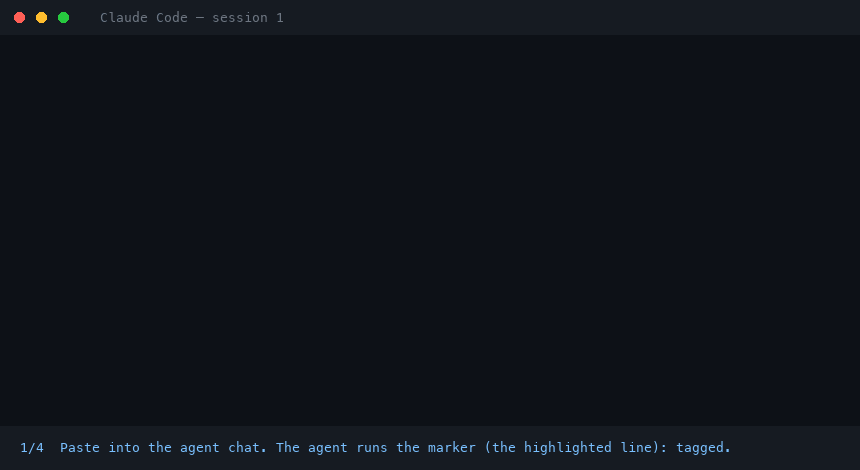
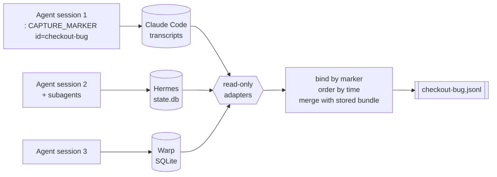

<div align="center">

# 🔖 agent-session-capture

### Tag an AI coding session. Get the whole conversation back.

Claude Code · Hermes · Warp → one chronological, greppable JSONL.

[](https://github.com/Amirault/agent-session-capture/actions/workflows/ci.yml)
[](LICENSE)


</div>

## What is it?

You work on one task with an AI agent over several sessions. Later you want the full history —
every prompt, tool call and answer — in one place. Agent runtimes store sessions in different
places and never group them by task.

**The trick:** during the session, the agent runs one harmless shell command that carries a name
you choose. Afterwards, this tool finds every session that ran it and exports them together.

```text
: CAPTURE_MARKER v=1 id=checkout-bug        ← "checkout-bug" is the name you choose
```

<div align="center">



<sub>Recorded from two real headless <code>claude -p</code> runs; the window is a re-enactment,
the prompts, commands and export output are real.
<a href="docs/demo/render.py">How it was made</a></sub>

</div>

## ⚡ In 60 seconds

**0 · Install once** (Node ≥ 22.2)

```bash
git clone https://github.com/Amirault/agent-session-capture.git ~/tools/agent-session-capture
cd ~/tools/agent-session-capture && npm install
```

**1 · Tag the session** — paste this into your agent chat, changing the name:

```text
Run this exact shell command now, as its own command, and change nothing else:
: CAPTURE_MARKER v=1 id=checkout-bug
```

The agent executes it (it prints nothing and does nothing — `:` is a shell no-op). Done: that
session is tagged. Repeat in every session of the same task, with the **same name**.

**2 · Export** — from your project folder, naming the agent you used:

```bash
~/tools/agent-session-capture/capture.sh --id checkout-bug --source claude-code
# wrote /your/project/.agent-captures/checkout-bug.jsonl (199 events, 3 conversations)
```

`--source` is `claude-code`, `hermes` or `warp`.

**3 · Read it** — it's plain JSONL:

```bash
jq -r 'select(.kind=="query") | "\(.ts)  \(.content)"' .agent-captures/checkout-bug.jsonl
```

## 🏷️ Tagging, explained

| ✅ Do | ❌ Don't |
| --- | --- |
| Ask **the agent** to run the command, as in step 1. | Type it in your own terminal — it isn't part of the agent's session, so it won't be found. |
| Use the **same `id`** in every session of the task. | Change the `id` between sessions of one task. |
| Use letters, digits, `.` `_` `-` for the `id` (`JIRA-123`, `fix-login-bug`). | Use spaces, quotes or `/` in the `id`. |
| Copy the line **exactly**, including `v=1`. | Mention it in prose — only an *executed* command counts. |

**Check it worked:** the export says `N conversations`. If it says
`no conversations bound`, the marker was never executed in that runtime — ask the agent again,
and check `--source` matches the agent you used.

**Make it automatic** — add this to your agent's rules file (`CLAUDE.md`, `AGENTS.md`, …) so you
only have to say the name:

```markdown
When I give you a capture id (e.g. "capture id: checkout-bug"), immediately run this exact
shell command as its own call, with that id, before anything else:
`: CAPTURE_MARKER v=1 id=<id>`
```

Or copy the ready-made skill: [`skills/capture-marker`](skills/capture-marker/SKILL.md).

## 🎯 Why a marker?

Guessing which sessions belong together ("they mention the ticket") gives false positives and
misses. An explicit, executed marker is deterministic, works the same in every runtime, and is
easy to share — paste the line in a PR description and a teammate's sessions export by the same
name.

<details>
<summary><b>🔌 Supported agents (adapters)</b></summary>

| `--source`    | Reads                                                    | Highlights                                                  |
| ------------- | -------------------------------------------------------- | ----------------------------------------------------------- |
| `claude-code` | `~/.claude/projects/**/*.jsonl`                          | Subagent transcripts join their parent session.             |
| `hermes`      | `<HERMES_HOME>/state.db` (SQLite, read-only)             | Compression continuations and delegate subagents followed.  |
| `warp`        | Warp's local SQLite DB (macOS), via a read-only snapshot | Recovers assistant text from protobuf blobs, schema-less.   |

Your agent isn't listed? [Write the next adapter](docs/ADAPTERS.md) — one small
`ConversationReader` (Cursor, Codex CLI, Aider…). Contributions welcome.

</details>

<details>
<summary><b>🧩 How it works</b></summary>



1. **Mark** — the marker runs as a real shell command, so every runtime records it verbatim.
2. **Bind** — each adapter looks for _executed_ markers and ties them to their conversations,
   subagents included.
3. **Export** — events are ordered by time across conversations while each conversation keeps its
   own message order, then merged with whatever you captured before.

</details>

<details>
<summary><b>🏷️ Labels — telling several conversations of one task apart</b></summary>

Add an optional free-form label — a step, a role, a retry number:

```text
: CAPTURE_MARKER v=1 id=checkout-bug label=review
```

Labels are copied into every event and tallied in the bundle header. Nothing more.

</details>

<details>
<summary><b>📦 Output format</b></summary>

Strict NDJSON — one header, then one event per line:

```json
{"type":"bundle_header","capture_id":"checkout-bug","labels":["default"],"conversations_per_label":{"default":3},"conversation_ids":["…"],"extracted_at":"…","source":"claude-code"}
{"capture_id":"checkout-bug","label":"default","conversation_id":"…","seq":1,"ts":"2026-06-30T10:10:00.000Z","role":"user","kind":"query","content":"fix the login redirect","meta":{"cwd":"/…"}}
```

`role`: `user` · `assistant` · `tool` — `kind`: `query` · `agent_message` · `command` ·
`tool_call` · `tool_result`. Full schema: [docs/REFERENCE.md](docs/REFERENCE.md#output-format).

</details>

<details>
<summary><b>🛟 Session stores forget — export at the end too</b></summary>

Warp keeps prompts in a ~10,000-row ring buffer and evicts the rows that tie a marker to its
conversation. Re-running the export is **decay-safe**: fresh events win, events already in
`.agent-captures/<id>.jsonl` fill the gaps. Export at the end of a session and the history stays
recoverable after the runtime has moved on. Captures made from a disposable git worktree land in
the **main checkout's** `.agent-captures/`, so they outlive the worktree.

</details>

<details>
<summary><b>🔒 Safety & privacy</b></summary>

- Live stores are opened **read-only** — Warp through a `VACUUM INTO` snapshot deleted afterwards,
  Hermes through one read-only transaction; Claude Code transcripts are plain files.
- Nothing is sent anywhere. The only thing written is `.agent-captures/<id>.jsonl`.
- Bundles hold your **raw prompts and tool output**: add `.agent-captures/` to your project's
  `.gitignore` and review a bundle before sharing it.

</details>

<details>
<summary><b>🤝 Using it in a team</b></summary>

- Put the rules-file snippet above (or [`skills/capture-marker`](skills/capture-marker/SKILL.md))
  in your repo so every agent tags its sessions.
- Paste the marker line in a PR description — a teammate's sessions that ran it export by the
  same `id`.
- Let an orchestrator inject it, with a per-run id, into every subagent prompt.

</details>

<details>
<summary><b>📚 Docs, development & license</b></summary>

- [The `CAPTURE_MARKER` convention](docs/MARKER.md) — format, emission rules, how each runtime binds it
- [Adapters](docs/ADAPTERS.md) — how sources are read, how to write one
- [Reference](docs/REFERENCE.md) — CLI flags, exit codes, output schema, limitations

**Warp schema (AGPL).** The Warp protobuf schemas are not vendored. Without them Warp assistant
text is still recovered, with numbered field paths; run `npm run gen:schema` to download them and
get readable paths ([details](docs/REFERENCE.md#develop)).

```bash
npm test            # fixture-based, no real session store needed
npm run typecheck
```

[MIT](LICENSE) — made by [@Amirault](https://github.com/Amirault).

</details>
