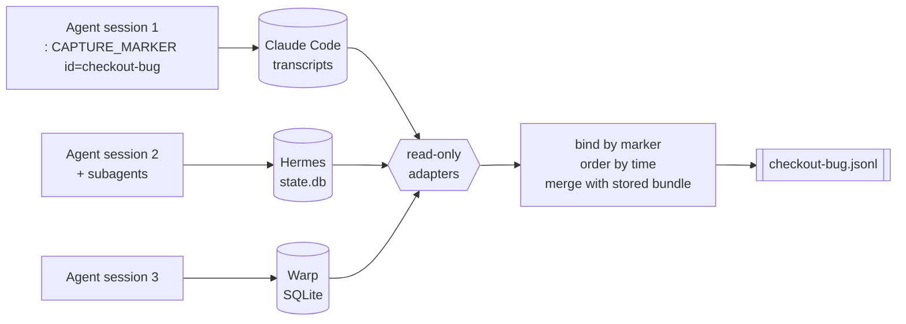

<div align="center">

# 🔖 agent-session-capture

### One line to tag an AI coding session. One command to get every tagged session back.

Claude Code · Hermes · Warp — exported as a single, chronological, greppable JSONL.

[](https://github.com/Amirault/agent-session-capture/actions/workflows/ci.yml)
[](LICENSE)


</div>

```text
: CAPTURE_MARKER v=1 id=checkout-bug
```

That's the whole integration. A shell **no-op** that the agent — or you — runs once at the start
of a session. Later, `capture.sh` finds every conversation that ran it, across sessions and
subagents, and hands you the full story.

---

## ✨ Why you'll want this

You fixed a bug with an agent over three sessions, two subagents and a lunch break. Now you want
to know **what actually happened**: which prompts worked, where the agent went in circles, what
it cost you in time. Your runtimes each hide that history in a different place, and none of them
group it by _task_.

|                               | Guessing from session text          | `CAPTURE_MARKER`                    |
| ----------------------------- | ----------------------------------- | ----------------------------------- |
| Finds the right sessions      | 🎲 false positives, misses          | ✅ only sessions that ran the marker |
| Works across agent runtimes   | ❌ one parser per tool, per task     | ✅ same line everywhere              |
| Shareable with a teammate     | ❌                                  | ✅ paste the line in a PR or chat    |
| Survives the runtime forgetting | ❌                                | ✅ decay-safe merge                  |

## 🚀 30-second tour

```bash
git clone https://github.com/Amirault/agent-session-capture.git ~/tools/agent-session-capture
cd ~/tools/agent-session-capture && npm install        # Node >= 22.2
```

**1. Tag a session** — type it, or tell your agent to run it:

```text
: CAPTURE_MARKER v=1 id=checkout-bug
```

**2. Export** — from your project, any subdirectory:

```console
$ ~/tools/agent-session-capture/capture.sh --id checkout-bug --source claude-code
wrote /path/to/your/project/.agent-captures/checkout-bug.jsonl (199 events, 3 conversations)
```

**3. Use it** — it's plain JSONL:

```console
$ jq -r 'select(.kind=="query") | "\(.ts)  \(.content)"' .agent-captures/checkout-bug.jsonl
2026-06-30T10:10:00.000Z  fix the login redirect
2026-06-30T10:42:13.000Z  no, the bug is in the session middleware
2026-06-30T11:05:51.000Z  add a regression test
```

> `--source` must match the runtime the session ran in: `claude-code`, `hermes` or `warp`.

## 🧩 How it works



1. **Mark** — the marker runs as a real shell command, so every runtime records it verbatim.
2. **Bind** — each adapter looks for _executed_ markers (prose that merely mentions it never
   counts) and ties them to their conversations, subagents included.
3. **Export** — events are ordered by time across conversations while each conversation keeps
   its own message order, then merged with whatever you captured before.

## 🔌 Adapters

| `--source`    | Reads                                                    | Highlights                                                  |
| ------------- | -------------------------------------------------------- | ----------------------------------------------------------- |
| `claude-code` | `~/.claude/projects/**/*.jsonl`                          | Subagent transcripts join their parent session.             |
| `hermes`      | `<HERMES_HOME>/state.db` (SQLite, read-only)             | Compression continuations and delegate subagents followed.  |
| `warp`        | Warp's local SQLite DB (macOS), via a read-only snapshot | Recovers assistant text from protobuf blobs, schema-less.   |

Your agent isn't on the list? Every adapter implements one small port —
[**write the next one**](docs/ADAPTERS.md) (Cursor, Codex CLI, Aider…) in a single
`ConversationReader`. Contributions welcome.

## 🏷️ Labels (optional)

Several conversations, one task? Add a free-form label to tell them apart — a step, a role, a
retry number:

```text
: CAPTURE_MARKER v=1 id=checkout-bug label=review
```

Labels are copied into every event and tallied in the bundle header. Nothing more, nothing less.

## 🤝 Make it a team habit

The marker is easy to _suggest_, not just hard-code:

- **Drop it in a rules file or skill** so agents emit it at the start of every task →
  [`skills/capture-marker`](skills/capture-marker/SKILL.md) is ready to copy.
- **Paste it in a PR description** — a teammate's sessions that ran it export with the same `id`.
- **Let an orchestrator inject it** with a per-run id into every subagent prompt.

## 📦 What you get

Strict NDJSON — one header, then one event per line:

```json
{"type":"bundle_header","capture_id":"checkout-bug","labels":["default"],"conversations_per_label":{"default":3},"conversation_ids":["…"],"extracted_at":"…","source":"claude-code"}
{"capture_id":"checkout-bug","label":"default","conversation_id":"…","seq":1,"ts":"2026-06-30T10:10:00.000Z","role":"user","kind":"query","content":"fix the login redirect","meta":{"cwd":"/…"}}
```

`role`: `user` · `assistant` · `tool` — `kind`: `query` · `agent_message` · `command` · `tool_call` ·
`tool_result`. Full schema in [docs/REFERENCE.md](docs/REFERENCE.md#output-format).

## 🛟 Session stores forget — this tool remembers

Warp keeps prompts in a ~10,000-row ring buffer and evicts the rows that tie a marker to its
conversation. Re-running the export is **decay-safe**: fresh events win, events already in
`.agent-captures/<id>.jsonl` fill the gaps. Export at the end of a session and the history stays
recoverable after the runtime has moved on. Captures made from a disposable git worktree land in
the **main checkout's** `.agent-captures/`, so they outlive the worktree.

## 🔒 Safety

- Live stores are opened **read-only** — Warp through a `VACUUM INTO` snapshot deleted
  afterwards, Hermes through one read-only transaction, Claude Code transcripts are plain files.
- Nothing is sent anywhere. The only thing written is `.agent-captures/<id>.jsonl`.
- Bundles hold your **raw prompts and tool output**: add `.agent-captures/` to your project's
  `.gitignore` and review a bundle before sharing it.

## 📚 Docs

| | |
| --- | --- |
| [The `CAPTURE_MARKER` convention](docs/MARKER.md) | Format, emission rules, how each runtime binds it |
| [Adapters](docs/ADAPTERS.md) | How sources are read, how to write one |
| [Reference](docs/REFERENCE.md) | CLI flags, exit codes, output schema, limitations |

<details>
<summary><b>Warp schema note (AGPL)</b></summary>

The Warp protobuf schemas are AGPL-3.0 and are not vendored here. Without them, Warp assistant
text is still recovered, with numbered field paths. Run `npm run gen:schema` to download them at
the pinned revision and get readable paths. See [REFERENCE](docs/REFERENCE.md#develop).

</details>

## 🛠️ Development

```bash
npm test            # vitest, fixture-based — no real session store needed
npm run typecheck
```

## 📄 License

[MIT](LICENSE) — made by [@Amirault](https://github.com/Amirault).
